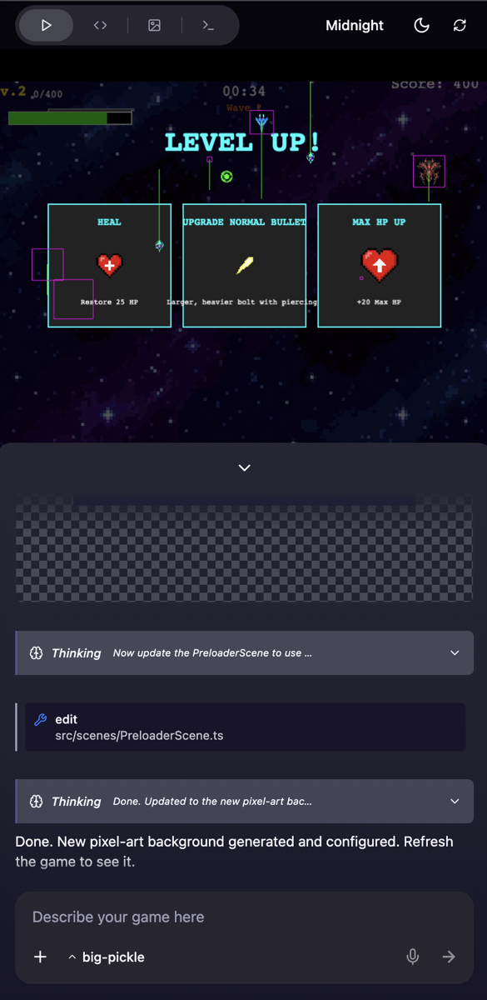

# Game Agent (WIP)

An AI-assisted game development workspace for building web games through chat.
Describe what you want, and the agent iterates on game code while you watch the
workspace update in real time.

Built as a Bun monorepo with:
- a React + Vite client (`apps/client`)
- an Elysia API server (`apps/server`)
- an OpenCode-backed agent wrapper (`packages/agent`, backed by the `packages/opencode` submodule)

## Demo

Hosted demo: https://gamemakeragent-client.onrender.com/


## Mobile Preview

<p align="center">
  
</p>

## Highlights

- Chat-driven game generation and iteration
- Live workspace sync with streaming updates (SSE)
- Prompt rewind/edit flow for fast experimentation
- Built-in code/file viewer and editor
- Template-based project bootstrap (Phaser 2D templates)
- Asset generation and save pipeline
- iOS packaging support via Capacitor

## Current Scope

- Implemented engine: `phaser-2d`
- `babylon-3d` is present as a placeholder in the registry and is not implemented yet
- Provider registration is currently done in `apps/server/src/config.ts` (UI-based provider creation is not wired yet)

## Repository Layout

```text
apps/
  client/              React + Vite UI (chat, editor, preview)
  server/              Bun + Elysia API/server orchestration
packages/
  agent/               Thin re-export wrapper around OpenCode game-agent
  common/              Shared utils/types (including image helpers)
  perf/                Perf telemetry helpers
  opencode/            Git submodule (upstream OpenCode codebase)
docs/images/           README visuals
workspaces/            Generated game projects at runtime (gitignored)
```

## Tech Stack

- Runtime: Bun
- Frontend: React 19, Vite, TypeScript, Zustand, CodeMirror, Tailwind CSS
- Backend: Elysia, Server-Sent Events (SSE), chokidar file watchers
- Agent runtime: OpenCode (vendored as a git submodule)

## Quick Start

### 1. Prerequisites

- Bun `>= 1.3`
- Git (with submodule support)

### 2. Clone and initialize submodules

```bash
git clone <your-fork-or-this-repo-url>
cd game-agent-opencode
git submodule update --init --recursive
```

### 3. Install dependencies

```bash
bun install
```

### 4. Configure models/providers

Provider registration is currently code-first.

1. Open `apps/server/src/config.ts`.
2. Update `DEFAULT_CONFIG` providers/models for your environment.
3. Add API keys as environment variables (for example in `apps/server/.env`).

Example optional `apps/server/.env`:

```dotenv
HOST=0.0.0.0
PORT=3001
ANTIGRAVITY_API_KEY=your_key
NANOBANANA_API_KEY=your_key
NANOBANANA_BASE_URL=http://127.0.0.1:8045/v1
```

Notes:
- There is no committed `.env.example` in this repo.
- The default client server URL is `http://localhost:3001`.
- Override the client target with `VITE_SERVER_URL` when needed.

### 5. Run development servers

```bash
# Server + client together
bun run dev

# Run individually
bun run dev:server   # http://localhost:3001
bun run dev:client   # http://localhost:5173
```

Open `http://localhost:5173`.

## Scripts

- `bun run dev`: run server and client together
- `bun run dev:server`: run Bun/Elysia server in watch mode
- `bun run start:server`: run server without watch mode
- `bun run dev:client`: run Vite client
- `bun run build:client`: production build for client
- `bun run typecheck`: strict TypeScript check for packages
- `bun run test:agent -- "<prompt>"`: smoke test the agent wrapper

## Runtime Flow

1. Client fetches templates (`/templates`) and creates a session (`/api/session/create`).
2. Server seeds a workspace under `workspaces/<session-id>`.
3. Prompt runs stream through `/api/run/start` via SSE events.
4. File changes are watched and sent back as patch ops to keep UI + disk in sync.
5. Sessions can be rewound/edited with `/api/session/rewind`.

## iOS Development (Client)

```bash
cd apps/client
bun run ios:sync
bun run ios:open
bun run ios
```

## Troubleshooting

- Missing agent/submodule code:
  Run `git submodule update --init --recursive`.
- Client cannot reach server:
  Set `VITE_SERVER_URL` (defaults to `http://localhost:3001`).
- Empty/invalid model list in Settings:
  Check provider config in `apps/server/src/config.ts` and restart server.
- No generated projects visible:
  Verify server can write to `workspaces/`.

## Contributing

- Keep changes focused and avoid formatting-only diffs.
- Run `bun run typecheck` before opening a PR.
- For agent behavior changes, also run:
  `bun run test:agent -- "Build a simple platformer"`.
