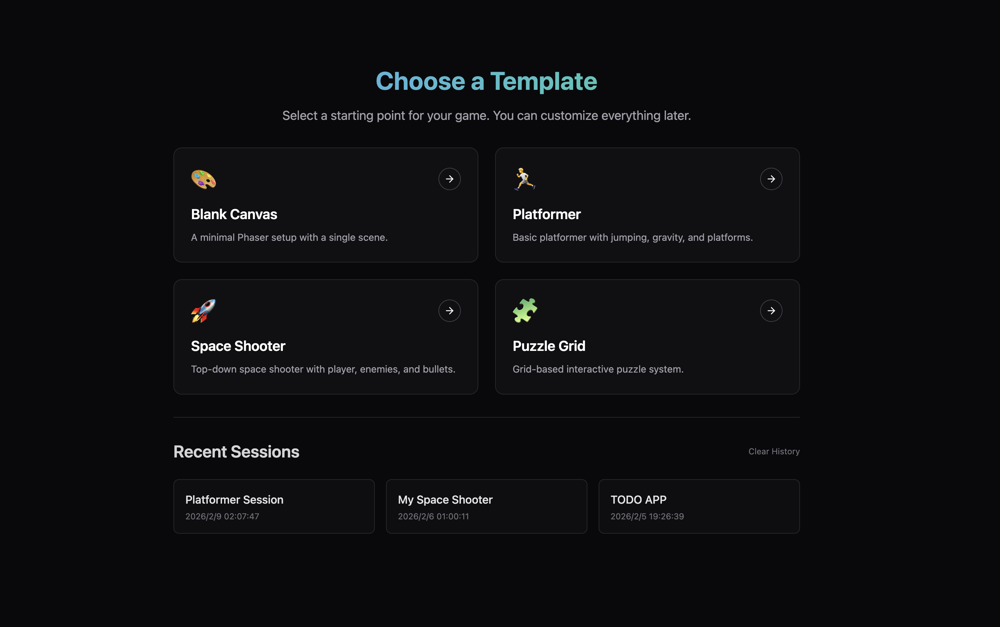
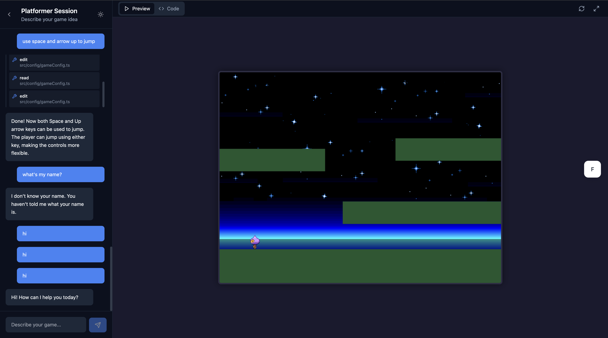

# 🎮 Game Agent

An AI-powered game development assistant that helps you create web games through natural language conversation. Describe your game idea, and the agent will generate, iterate, and refine the code in real-time.

## 🎬 Demo



<!-- Add your demo screenshot here -->


<!-- Add your demo GIF or video link here -->


## ✨ Features

- **Natural Language Game Creation** — Describe your game in plain English, and watch it come to life
- **Real-time Code Generation** — See code being written as you chat with the agent
- **Live Preview** — Instantly preview your game as it's being built
- **Iterative Development** — Request changes and refinements through conversation
- **File System Visualization** — Browse and edit generated code in an integrated editor
- **Cross-platform** — Web-based client with iOS support via Capacitor

## 🏗️ Architecture

```
├── apps/
│   ├── client/          # React + Vite frontend
│   │   ├── components/  # UI components (chat, editor, preview)
│   │   ├── hooks/       # Custom React hooks
│   │   └── stores/      # Zustand state management
│   └── server/          # Bun + Elysia backend
│       ├── routes/      # API endpoints
│       └── services/    # Agent orchestration
└── packages/
    ├── agent/           # AI agent runtime
    ├── common/          # Shared types and utilities
    └── perf/            # Performance monitoring
```

## 🛠️ Tech Stack

### Frontend
- **React 18** with TypeScript
- **Vite** for fast development
- **TailwindCSS** for styling
- **CodeMirror 6** for code editing
- **Zustand** for state management
- **Capacitor** for iOS deployment

### Backend
- **Bun** runtime for blazing fast performance
- **Elysia** web framework
- **WebSocket** for real-time streaming
- **AI SDK** for LLM integration

## 🚀 Quick Start

### Prerequisites

- [Bun](https://bun.sh) v1.3+
- Node.js 18+ (for some tooling)

### Installation

```bash
# Clone the repository (with submodules for templates)
git clone --recursive https://github.com/yourusername/game-agent.git
cd game-agent

# Install dependencies (will also fetch submodules if missed)
bun install

# Set up environment variables
cp .env.example .env
# Add your API keys to .env
```

### Development

```bash
# Start both client and server
bun run dev

# Or run separately:
bun run dev:server   # Backend on http://localhost:3000
bun run dev:client   # Frontend on http://localhost:5173
```

### Build for Production

```bash
# Build the client
bun run build:client
```

## 📱 iOS Development

```bash
cd apps/client

# Sync with iOS project
bun run ios:sync

# Open in Xcode
bun run ios:open

# Run on device/simulator
bun run ios
```

## 🤝 Contributing

Contributions are welcome! Please feel free to submit a Pull Request.

## 📄 License

MIT License — feel free to use this project for learning and development.